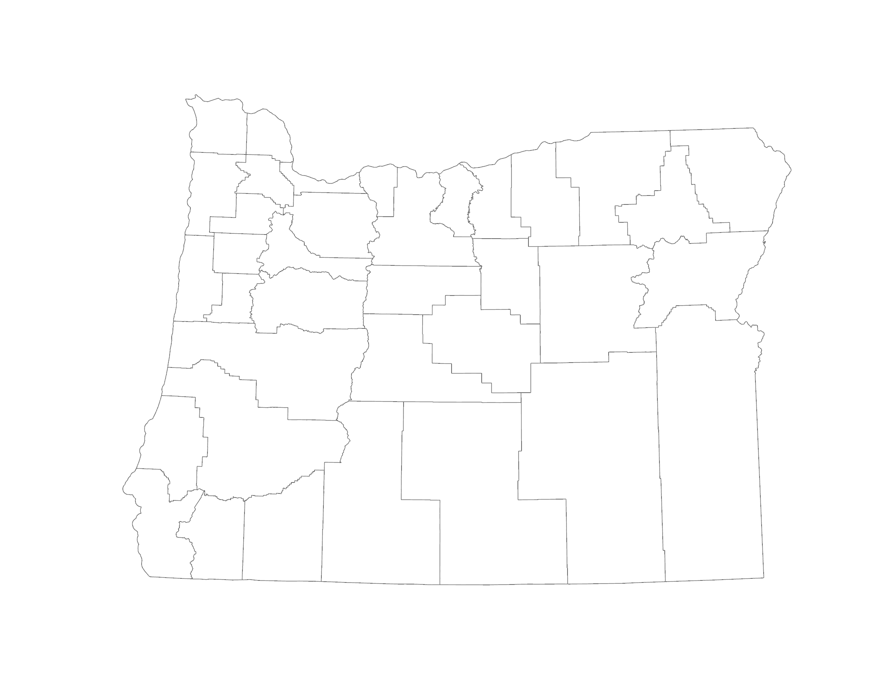
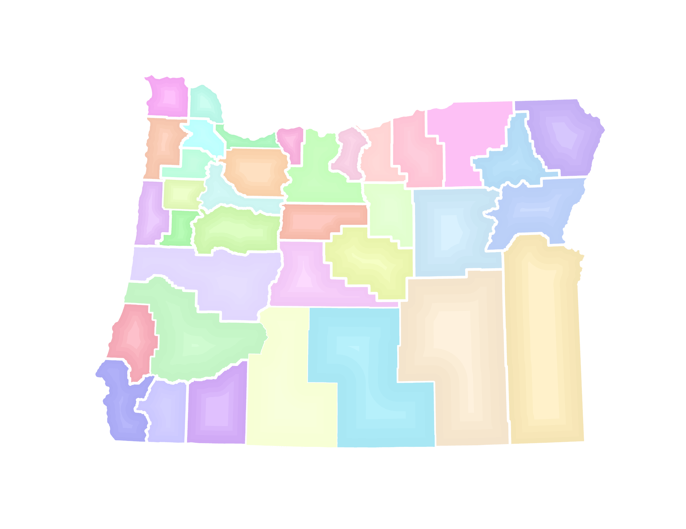

I had a map of Oregon in which I followed some John Nelson tutorials to have each county filled with a pastel along with a darker vignette along the borders and an inner glow.

For a Python exercise, I was curious for the steps to start with a blank map of Oregon counties, and then add three random colored counties in a cumulative fashion until the
blank map of Oregon was full of the pastel colors. And then reverse this process so that three colored counties would be taken away at random, so that the colored map reverts
to the original blank state.

In other words, start from this:

to this:

I wanted to ensure that no same three counties were batched together when either being added or removed. I also wanted the add / remove animation to run five times, and then have a GIF created in my output path folder.

After a day of debugging, below is the final script to use Python in ArcGIS Pro create an animated GIF.

# START

import arcpy
import os
import random
from PIL import Image
import glob

# 1. ENVIRONMENT SETUP
aprx = arcpy.mp.ArcGISProject("CURRENT")
mp = aprx.listMaps()[0]

blank_layer_name = "orcntypoly"
colored_layer_name = "County Layer for GIF"

blank_layer = mp.listLayers(blank_layer_name)[0]
colored_layer = mp.listLayers(colored_layer_name)[0]

# If it's a group layer, drill down
if colored_layer.isGroupLayer:
    colored_layer = colored_layer.listLayers()[0]

# Clear filters and selections
colored_layer.definitionQuery = ""
arcpy.management.SelectLayerByAttribute(colored_layer, "CLEAR_SELECTION")

# Layout + map frame
layout = aprx.listLayouts()[0]
mapframe = layout.listElements("MAPFRAME_ELEMENT")[0]

# Output folder
output_folder = r"D:\GIS\Colorful Oregon Counties GIF\Frames"
os.makedirs(output_folder, exist_ok=True)

print("Environment ready.")
print("Blank layer:", blank_layer.name)
print("Colored layer:", colored_layer.name)

# 2. NORMALIZATION + UNIQUE COUNTY LIST
def normalize(code):
    return str(code).zfill(3)

county_field = "COBCODE"

all_counties = sorted({
    normalize(row[0].replace("OR", ""))
    for row in arcpy.da.SearchCursor(colored_layer, [county_field])
})

print("Unique counties:", len(all_counties))
print(all_counties)

# 3. UNIQUE BATCH PICKER
def pick_unique_batch(remaining, used_batches):
    attempts = 0
    while True:
        attempts += 1

        if len(remaining) <= 3:
            batch = remaining[:]
        else:
            batch = random.sample(remaining, 3)

        batch = [normalize(c) for c in batch]
        key = tuple(sorted(batch))

        if key not in used_batches:
            used_batches.add(key)
            return batch

        if attempts > 1000:
            raise RuntimeError("Unable to find unused batch — too many cycles requested.")

# 4. FORWARD ANIMATION
def forward_cycle(start_frame, used_batches):
    remaining = all_counties.copy()
    colored_so_far = []
    frame = start_frame

    # Blank frame
    colored_layer.definitionQuery = "1 = 0"
    layout.exportToPNG(os.path.join(output_folder, f"frame_{frame:03d}.png"), resolution=200)
    frame += 1

    while remaining:
        batch = pick_unique_batch(remaining, used_batches)

        for c in batch:
            if c not in colored_so_far:
                colored_so_far.append(c)

        sql_values = ",".join([f"'OR{c}'" for c in colored_so_far])
        sql = f"{county_field} IN ({sql_values})"
        colored_layer.definitionQuery = sql

        layout.exportToPNG(os.path.join(output_folder, f"frame_{frame:03d}.png"), resolution=200)
        frame += 1

        for c in batch:
            if c in remaining:
                remaining.remove(c)

    return frame, colored_so_far.copy()

# 5. REVERSE ANIMATION
def reverse_cycle(start_frame, full_list, used_batches):
    remaining = full_list.copy()
    colored_so_far = full_list.copy()
    frame = start_frame

    sql_values = ",".join([f"'OR{c}'" for c in colored_so_far])
    sql = f"{county_field} IN ({sql_values})"
    colored_layer.definitionQuery = sql
    layout.exportToPNG(os.path.join(output_folder, f"frame_{frame:03d}.png"), resolution=200)
    frame += 1

    while remaining:
        batch = pick_unique_batch(remaining, used_batches)

        for c in batch:
            if c in colored_so_far:
                colored_so_far.remove(c)

        if colored_so_far:
            sql_values = ",".join([f"'OR{c}'" for c in colored_so_far])
            sql = f"{county_field} IN ({sql_values})"
        else:
            sql = "1 = 0"

        colored_layer.definitionQuery = sql

        layout.exportToPNG(os.path.join(output_folder, f"frame_{frame:03d}.png"), resolution=200)
        frame += 1

        for c in batch:
            if c in remaining:
                remaining.remove(c)

    return frame

# 6. RUN 5 FULL CYCLES
frame_counter = 1

for cycle in range(5):
    print(f"=== Starting cycle {cycle+1} ===")

    used_batches = set()

    frame_counter, full_list = forward_cycle(frame_counter, used_batches)
    frame_counter = reverse_cycle(frame_counter, full_list, used_batches)

print("All 5 cycles complete.")

# 7. CREATE GIF FROM FRAMES
print("Building GIF...")

frames = []
for file in sorted(glob.glob(os.path.join(output_folder, "frame_*.png"))):
    frames.append(Image.open(file))

gif_path = os.path.join(output_folder, "oregonanimation.gif")

frames[0].save(
    gif_path,
    save_all=True,
    append_images=frames[1:],
    duration=120,
    loop=0
)

print("GIF created:", gif_path)

# END

The final result:

